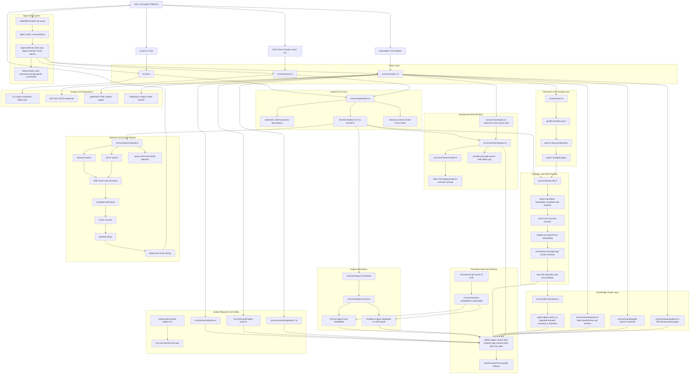

# GBrain Repository Architecture

```mermaid
flowchart TB
    A[Users and Agent Platforms]
    A1[Local CLI User]
    A2[MCP Client Claude Cursor etc]
    A3[Automation Cron Worker]
    A --> A1
    A --> A2
    A --> A3

    subgraph Entry[Entry Layer]
      C1[src/cli.ts]
      C2[src/mcp/server.ts]
      C3[src/commands/*.ts]
    end

    A1 --> C1
    A2 --> C2
    A3 --> C3

    subgraph Contract[Contract First Core]
      O1[src/core/operations.ts]
      O2[Operation schema params descriptions]
      O3[Shared handlers for CLI and MCP]
      O4[Security context remote true or false]
    end

    C1 --> O1
    C2 --> O1
    O1 --> O2
    O1 --> O3
    O1 --> O4

    subgraph EngineFactory[Engine Abstraction]
      E0[src/core/engine.ts interface]
      E1[src/core/engine-factory.ts]
      E2[PGLite engine local embedded]
      E3[Postgres engine Supabase or self hosted]
    end

    O3 --> E0
    E0 --> E1
    E1 --> E2
    E1 --> E3

    subgraph Storage[Persistent Data and Schema]
      D1[src/schema.sql source of truth]
      D2[src/core/schema-embedded.ts generated]
      D3[Tables pages chunks links timeline tags versions files jobs raw_data]
      D4[Vector keyword and graph indexes]
    end

    E2 --> D3
    E3 --> D3
    D1 --> D2
    D2 --> E2
    D2 --> E3
    D3 --> D4

    subgraph Ingest[Ingestion and Write Pipeline]
      I1[src/core/import-file.ts]
      I2[parse markdown frontmatter compiled truth timeline]
      I3[chunk text recursive chunker]
      I4[embed via OpenAI text embedding]
      I5[transaction put page tags chunks versions]
      I6[auto link extraction and reconciliation]
    end

    O3 --> I1
    I1 --> I2
    I2 --> I3
    I3 --> I4
    I4 --> I5
    I5 --> I6
    I6 --> D3

    subgraph Search[Retrieval and Query Pipeline]
      S1[src/core/search/hybrid.ts]
      S2[keyword search]
      S3[vector search]
      S4[RRF fusion and normalize]
      S5[compiled truth boost]
      S6[cosine rescore]
      S7[backlink boost]
      S8[dedup and result slicing]
      S9[query intent auto detail selection]
    end

    O3 --> S1
    S1 --> S9
    S1 --> S2
    S1 --> S3
    S2 --> S4
    S3 --> S4
    S4 --> S5
    S5 --> S6
    S6 --> S7
    S7 --> S8
    S8 --> A

    subgraph Graph[Knowledge Graph Layer]
      G1[src/core/link-extraction.ts]
      G2[typed edges works_at attended founded invested_in mentions]
      G3[src/commands/extract.ts batch backfill links and timeline]
      G4[src/commands/graph-query.ts traversal]
      G5[src/commands/orphans.ts find disconnected pages]
    end

    I6 --> G1
    G1 --> G2
    G2 --> D3
    C3 --> G3
    C3 --> G4
    C3 --> G5
    G3 --> D3
    G4 --> D3
    G5 --> D3

    subgraph Jobs[Background Work Minions]
      M1[src/core/minions/queue.ts]
      M2[src/core/minions/worker.ts]
      M3[src/commands/jobs.ts submit list retry cancel work]
      M4[durable job graph parent child depth cap]
      M5[inbox messaging progress and lock renewal]
    end

    O3 --> M1
    M1 --> M2
    C3 --> M3
    M3 --> M1
    M1 --> M4
    M2 --> M5
    M1 --> D3

    subgraph Sync[Filesystem and Change Sync]
      Y1[src/core/sync.ts]
      Y2[git diff manifest parse]
      Y3[path to slug normalization]
      Y4[import changed pages]
    end

    C3 --> Y1
    Y1 --> Y2
    Y2 --> Y3
    Y3 --> Y4
    Y4 --> I1

    subgraph Quality[Quality Migration and Safety]
      Q1[src/commands/doctor.ts]
      Q2[src/commands/repair-jsonb.ts]
      Q3[src/commands/migrations/*.ts]
      Q4[scripts/check-jsonb-pattern.sh]
      Q5[test and test/e2e full suite]
    end

    C3 --> Q1
    C3 --> Q2
    C3 --> Q3
    Q4 --> Q5
    Q1 --> D3
    Q2 --> D3
    Q3 --> D3

    subgraph Skills[Agent Skill System]
      K1[skills/RESOLVER.md router]
      K2[skills/* SKILL.md workflows]
      K3[signal detector brain ops ingest maintain enrich reports]
      K4[deterministic code execution through gbrain commands]
    end

    A --> K1
    K1 --> K2
    K2 --> K3
    K3 --> C1
    K3 --> C2
    K3 --> C3
    K3 --> K4

    subgraph Outputs[Outputs and Integrations]
      Z1[CLI output markdown tables json]
      Z2[MCP tool JSON responses]
      Z3[published HTML reports pages]
      Z4[integration recipes under recipes]
    end

    C1 --> Z1
    C2 --> Z2
    C3 --> Z3
    C3 --> Z4
```
