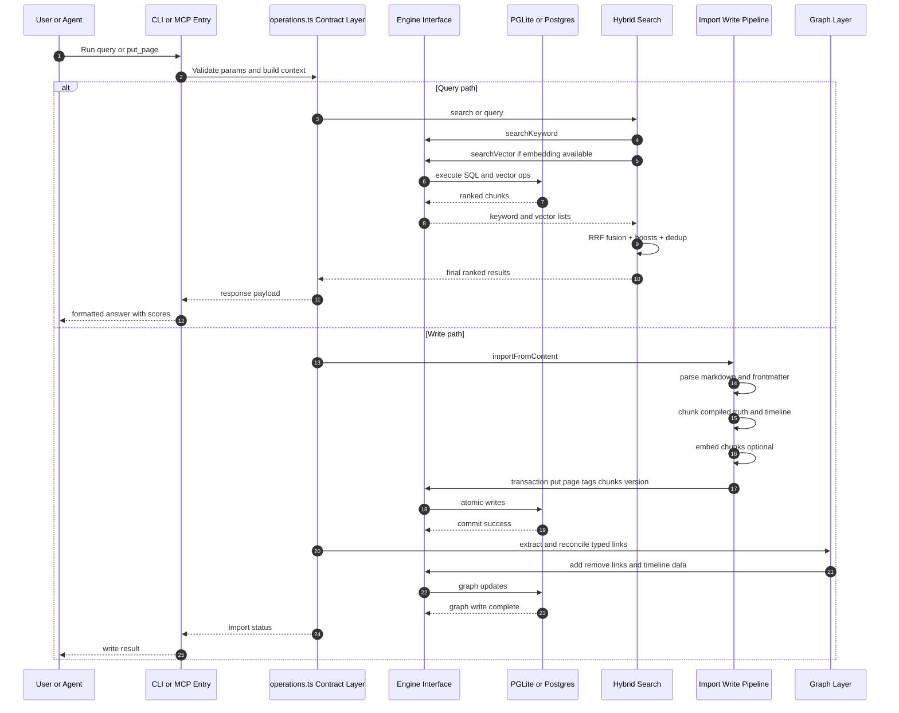

# End-to-End Request Lifecycle in GBrain

```mermaid
sequenceDiagram
    autonumber
    participant U as User or Agent
    participant CLI as CLI or MCP Entry
    participant OPS as operations.ts Contract Layer
    participant ENG as Engine Interface
    participant DB as PGLite or Postgres
    participant SRCH as Hybrid Search
    participant WR as Import Write Pipeline
    participant KG as Graph Layer

    U->>CLI: Run query or put_page
    CLI->>OPS: Validate params and build context

    alt Query path
      OPS->>SRCH: search or query
      SRCH->>ENG: searchKeyword
      SRCH->>ENG: searchVector if embedding available
      ENG->>DB: execute SQL and vector ops
      DB-->>ENG: ranked chunks
      ENG-->>SRCH: keyword and vector lists
      SRCH->>SRCH: RRF fusion + boosts + dedup
      SRCH-->>OPS: final ranked results
      OPS-->>CLI: response payload
      CLI-->>U: formatted answer with scores
    else Write path
      OPS->>WR: importFromContent
      WR->>WR: parse markdown and frontmatter
      WR->>WR: chunk compiled truth and timeline
      WR->>WR: embed chunks optional
      WR->>ENG: transaction put page tags chunks version
      ENG->>DB: atomic writes
      DB-->>ENG: commit success
      OPS->>KG: extract and reconcile typed links
      KG->>ENG: add remove links and timeline data
      ENG->>DB: graph updates
      DB-->>ENG: graph write complete
      OPS-->>CLI: import status
      CLI-->>U: write result
    end
```
