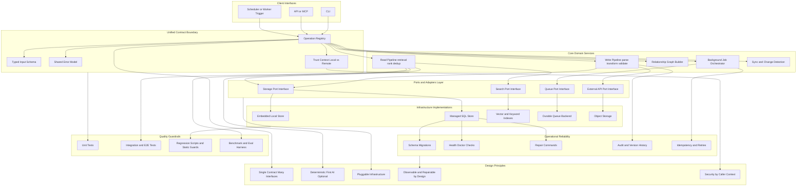

# Reusable Architecture Patterns You Can Lift Into Any Project

This diagram is tech-agnostic so you can reuse it as a baseline architecture in your own systems.

## How to apply this quickly

1. Start with an operation registry and run every entry point through it.
2. Make your core services depend on interfaces, not database SDKs.
3. Keep write and read pipelines explicit and stage-based.
4. Add a trust-context flag so local and remote calls can share logic safely.
5. Ship doctor, repair, and migration commands from day one.
6. Treat evaluation and regression checks as architecture, not optional tooling.
